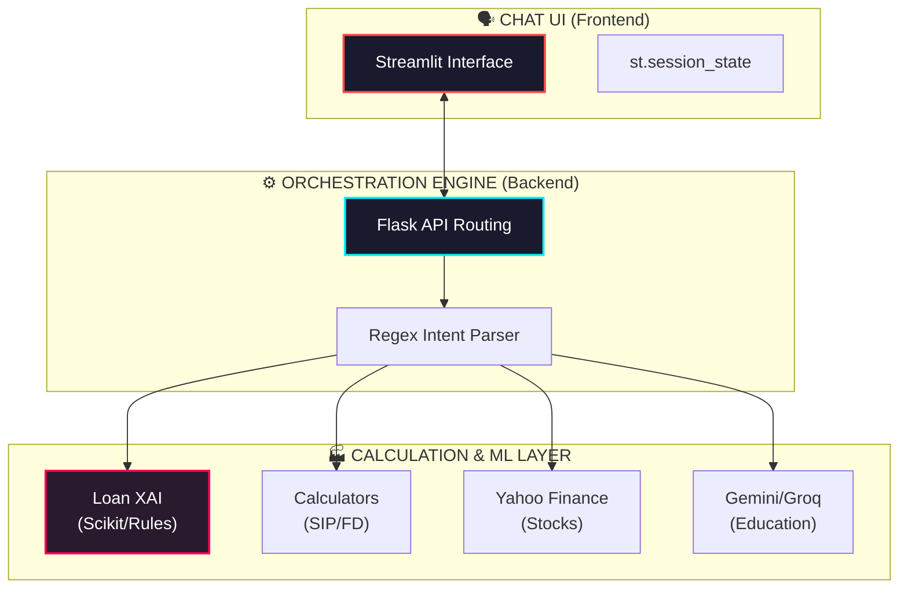
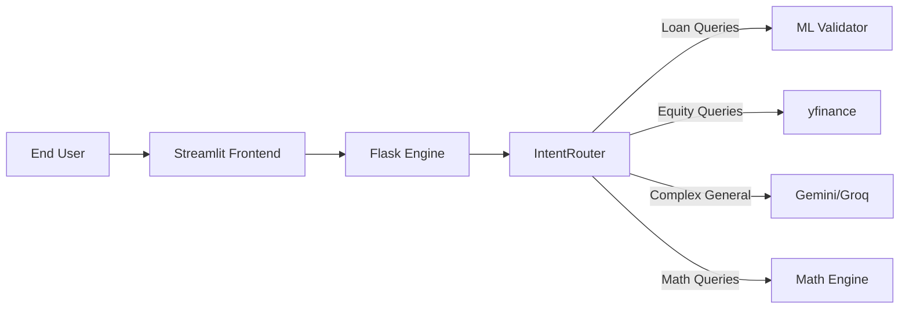

# 🏦 Financial Explainable AI Chatbot

<p align="center">
  
</p>

<p align="center">
  
  
</p>

<p align="center">
  
  
  
</p>

---

## 📖 Project Manifesto

### **The Financial Opacity Challenge**

As financial institutions scale their use of complex machine learning models for credit scoring and financial evaluation, a significant barrier emerges: **The Black Box Problem**. When users are denied loans or given financial predictions by deep algorithms, the lack of transparency leads to **frustration**, **regulatory non-compliance**, and **mistrust**.

### **The XAI Solution**

The Financial Explainable AI Chatbot is a research-driven, high-performance interactive engine designed to democratize automated financial decision-making. It provides a **Conversational Control Plane** that abstracts complex predictive algorithms and real-time APIs into a completely transparent, human-readable interface.

> _This isn't just a chatbot—it's a transparent financial advisor that explicitly shows its math._

---

## 👥 Engineering Team

This project is built and maintained by a dedicated engineering group from **Ajeenkya D Y Patil University**.

<div align="center">

|                                                                                       **Priyanshu Kumar Sharma**                                                                                        |                                            **Vaishnavi Jadhav**                                            |                                         **Vaibhav Gulge**                                         |
| :-----------------------------------------------------------------------------------------------------------------------------------------------------------------------------------------------------: | :--------------------------------------------------------------------------------------------------------: | :-----------------------------------------------------------------------------------------------: |
|                                                                                                                    |                   |                |
|                                                                                   **Backend & Machine Learning Lead**                                                                                   |                                       **Frontend & UI/UX Engineer**                                        |                                   **Frontend & UI/UX Engineer**                                   |
|                                                         Flask API architecture, AI prediction modeling, intent routing \& system integrations.                                                          |              Streamlit interface systems, conversational workflow design, and visualization.               |           User experience optimization, interactive elements, and layout architectures.           |
| [GitHub](https://github.com/PriyanshuKSharma) • [LinkedIn](https://www.linkedin.com/in/priyanshu-kumar-sharma-333800251/) • [Portfolio](https://priyanshuksharma.github.io/portfolio_priyanshuksharma/) | [GitHub](https://github.com/vaish105) • [LinkedIn](https://www.linkedin.com/in/vaishnavi-jadhav-92bb6635b) | [GitHub](https://github.com/VaibhavGulge) • [LinkedIn](https://www.linkedin.com/in/vaibhav-gulge) |

</div>

---

## 🚀 Innovative Features

### 🧠 **Explainable Loan Engine**

Never receive a generic "Loan Denied" message again. Our integrated XAI engine analyzes your credit and income inputs to provide:

- **Explicit Threshold Justifications**: Shows exactly why a component failed (e.g., Debt-to-Income exceeding strict boundaries).
- **Dual-Layer Execution**: Utilizes pre-trained Pickled models (Random Forest) with an immediate transparent rule-based fallback algorithm if ML predictions fault.

### 📈 **Live Equity Intel**

- **YFinance API Integration**: Fetches real-time stock prices, 52-week highs/lows, and trend directions.
- **Smart Natural Language Routing**: Recognizes explicit tickers (AAPL) and conversational patterns ("what is the stock price of reliance") to instantly bypass text engines and show live dashboards.

### 🧮 **Transparent Calculators**

Natively handles complex math parameters pulled directly from conversational context:

- Systematic Investment Plans (SIP) and Compound Interest returns detailed mathematically.

---

## 🛠️ The Tech Arsenal

<div align="center">

| **Frontend**                                                                                                 | **Backend / API**                                                                                | **Data & ML**                                                                                                                 | **AI Services**                                                                                             |
| :----------------------------------------------------------------------------------------------------------- | :----------------------------------------------------------------------------------------------- | :---------------------------------------------------------------------------------------------------------------------------- | :---------------------------------------------------------------------------------------------------------- |
|  |  |  |  |
|           |                  |                     |        |

</div>

### **Deep-Dive: Technical Reference**

#### **🎨 Frontend: The Interactive Canvas**

- **Streamlit**: leverages **Streamlit's reactive loops** to maintain a dynamic and fluid chat interface. We preserve physical conversation continuity globally using `st.session_state`.
- **Markdown & SVG Logic**: Uses integrated SVG rendering to display beautiful failure-resistant graphical data without relying on heavy frontend JS chart libraries.

#### **⚙️ Backend: The Orchestration API**

- **Flask (Python 3.10+)**: Chosen for its lightweight structure, acting as the primary asynchronous pipeline to process requests and sanitize JSON.
- **🗺️ Advanced Intent Router**: Determines if a query focuses on loan prediction, technical calculations, stock retrieval, or general education using regex boundaries and Natural Language positioning algorithms.

#### **🏭 Prediction & Explainability**

- **Rule-Based Fallbacks & Ensembles**: Our architecture relies on a pre-trained scikit-learn structure decoupled via `pickle`. If this binary fails or is unavailable, our robust rule-based heuristic system seamlessly takes over, guaranteeing 100% operational uptime and logic transparency.

---

## 🏗️ Technical Architecture

### **Data Flow Model**



### **Service Interaction**



---

## 🏁 Execution Protocol (Launch)

```bash
# 1. Initialize the Environment
git clone https://github.com/PriyanshuKSharma/xai_explainable_chatbot.git
python3 -m venv .venv
source .venv/bin/activate
pip install -r requirements.txt

# 2. Add Environment Variables
cp .env.example .env
# Important: Input your GEMINI_API_KEY and GROQ_API_KEY in the .env file

# 3. Deploy the Architecture
# Terminal 1: Run the backend API (Optional depending on .env switch)
python app.py

# Terminal 2: Run the Chat Interface
streamlit run ui.py
```

---

## 🗺️ Future Protocol (Roadmap)

- [ ] **LIME/SHAP Overlays**: Direct visual waterfall graph integration mapping out precise prediction weights cleanly into the Streamlit UI.
- [ ] **Multi-Modal Features**: Voice-driven prompts querying algorithmic structures.
- [ ] **Docker Engine Refactor**: Provide pure containerized topologies for strict 1-click execution.

---

### ⚖️ Legal & Memos

Licensed under MIT. Market data provided by Yahoo Finance. LLM Services provided by Google & Groq.

<p align="right">
  <i>Written & Developed by the Financial XAI Team</i>
</p>
